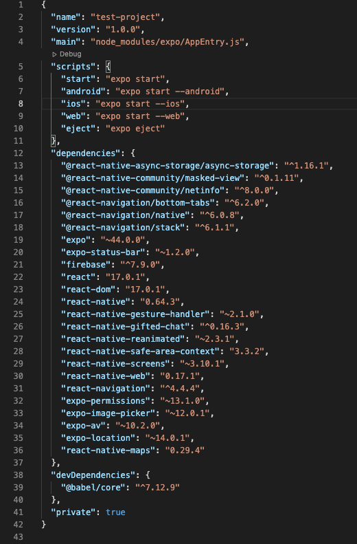

# chatApp

## Project Description

This App is a chat app built for mobile devices using React Native that provides its users with a customizable chat interface and options to share images and their locations with friends and family.

## Links

```bash

- [Repo](https://github.com/Cocoflosbach/chatApp> "<chatApp> Repo")

```

## Key Features

```bash
- A Start screen with the option for users to enter their names and choose a background color for their chat screen.
- A Chat screen with a chat feed that displays previosly sent messages as well as an input field that allows users to type and send in messages.
- An Action button that provides users the option to either select a photo from device library, Take a photo using device camera or share their geolocation.
- Availability of chat messages offline with the help of local storage.
```

## Built With

```bash
- JavaScript
- React Native
- Node.js
- Gifted Chat
- Google Firebase 
```

## Installation

```bash
- Clone this Repo
- Install all dependencies as seen below
- Run command 'npm start' or 'expo start' to open project in localhost
```

## Dependencies

```bash
 
```

## Author

**Coco Flosbach**

- [Profile](https://github.com/Cocoflosbach "Coco Flosbach")
- [Email](mailto:cocoflosbach@theasnbrand.com?subject=Hi "Hi!")
- [Website](https://cocoflosbach.github.io/Portfolio-site/ "Welcome")

## 🤝 Support

Contributions, issues, and feature requests are welcome!

Give a ⭐️ if you like this project!
